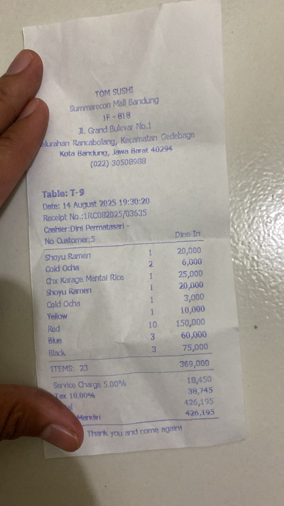
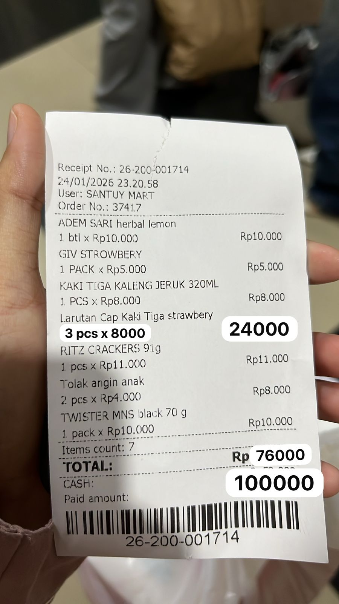

# Smart Split Bill AI

Prototype aplikasi web berbasis Streamlit untuk membaca foto nota secara
OCR-free, mengekstrak data transaksi, dan membagi tagihan kepada beberapa
orang.

**Created by: Hami Ahqafi**

> Status eksperimen: aplikasi dan pipeline benchmark sudah tersedia. Dua foto
> nota milik pengguna belum dimasukkan ke repository, sehingga tabel hasil
> eksperimen di bawah harus diisi setelah menjalankan benchmark pada kedua
> gambar tersebut. Hasil tidak dibuat-buat agar evaluasi tetap dapat
> direproduksi.

## Daftar Isi

- [Latar Belakang](#latar-belakang)
- [Fitur Prototype](#fitur-prototype)
- [Struktur Project](#struktur-project)
- [Instalasi dan Menjalankan Aplikasi](#instalasi-dan-menjalankan-aplikasi)
- [Riset dan Perbandingan Model](#riset-dan-perbandingan-model)
- [Menjalankan Eksperimen Dua Nota](#menjalankan-eksperimen-dua-nota)
- [Contoh Hasil Pembacaan](#contoh-hasil-pembacaan)
- [Alasan Pemilihan Model](#alasan-pemilihan-model)
- [Evaluasi Model Pembaca Bill](#evaluasi-model-pembaca-bill)
- [Evaluasi Produk Web](#evaluasi-produk-web)
- [Pengujian](#pengujian)
- [Keamanan](#keamanan)

## Latar Belakang

Smart Split Bill dikembangkan sebagai proof of concept untuk membantu pengguna:

1. Mengubah foto nota menjadi data transaksi terstruktur.
2. Memeriksa dan mengoreksi hasil pembacaan AI.
3. Menentukan orang yang menikmati setiap item.
4. Membagi pajak, service charge, diskon, dan biaya lainnya.
5. Memastikan total tagihan semua orang sama persis dengan total pada nota.

## Fitur Prototype

- Upload nota dalam format JPG, JPEG, PNG, atau WebP.
- Pembacaan nota menggunakan model vision tanpa EasyOCR atau PyTesseract.
- Dukungan Hugging Face Inference Providers, Groq Vision, dan OpenAI Vision.
- Ekstraksi:
  - nama merchant;
  - nama item;
  - jumlah item;
  - harga per item;
  - total harga item;
  - subtotal;
  - pajak, service charge, diskon, dan biaya tambahan;
  - total bill.
- Hasil ekstraksi dapat diedit untuk mengatasi kesalahan AI.
- Input beberapa peserta.
- Satu item dapat dipilih oleh satu atau beberapa peserta.
- Biaya tambahan dibagi proporsional berdasarkan nilai item yang dikonsumsi.
- Penanganan sisa pembulatan secara deterministik.
- Validasi bahwa jumlah tagihan seluruh peserta sama dengan total bill.
- Download hasil pembagian dalam format JSON.
- Mode demo jika API tidak tersedia.

## Struktur Project

```text
.
├── app.py                         # Antarmuka Streamlit
├── smart_split/
│   ├── ai.py                      # Integrasi model vision
│   ├── models.py                  # Normalisasi data receipt
│   └── splitter.py                # Algoritma pembagian bill
├── scripts/
│   └── benchmark_models.py        # Benchmark dua model pada dua nota
├── docs/
│   ├── receipts/                  # Simpan dua foto nota di sini
│   └── results/                   # Output benchmark tersimpan di sini
├── tests/
│   └── test_splitter.py
├── requirements.txt
└── .env.example
```

## Instalasi dan Menjalankan Aplikasi

### 1. Clone repository

```bash
git clone <URL_REPOSITORY_GITHUB>
cd smart-split-bill-ai
```

### 2. Buat virtual environment

Python 3.11 atau 3.12 direkomendasikan.

```bash
python3.12 -m venv venv312
source venv312/bin/activate
```

Untuk Windows:

```powershell
venv312\Scripts\activate
```

### 3. Install dependency

```bash
pip install -r requirements.txt
```

### 4. Siapkan API token

```bash
cp .env.example .env
```

Isi salah satu provider pada `.env`:

```env
HF_TOKEN=hf_your_token
GROQ_API_KEY=gsk_your_key
OPENAI_API_KEY=sk_your_key
OPENAI_MODEL=gpt-4.1-mini
```

Untuk Hugging Face, gunakan fine-grained token dengan izin **Make calls to
Inference Providers**. Jangan mengunggah `.env` ke GitHub.

### 5. Jalankan Streamlit

```bash
streamlit run app.py
```

Buka `http://localhost:8501`.

## Riset dan Perbandingan Model

Assignment mensyaratkan minimal dua model OCR-free. Model yang dibandingkan:

### Model 1 — Qwen3-VL-8B-Instruct

- Model ID: `Qwen/Qwen3-VL-8B-Instruct:fastest`
- Jenis: vision-language model.
- Eksekusi: Hugging Face Inference Providers.
- Alasan diuji:
  - dapat menerima gambar dan instruksi teks secara langsung;
  - dapat diminta menghasilkan JSON sesuai schema;
  - ukuran lebih kecil daripada varian Qwen VL yang lebih besar;
  - sesuai untuk nota dengan format yang bervariasi.

### Model 2 — Aya Vision 32B

- Model ID: `CohereLabs/aya-vision-32b:fastest`
- Jenis: multilingual vision-language model.
- Eksekusi: Hugging Face Inference Providers.
- Alasan diuji:
  - kemampuan multilingual relevan untuk nota Indonesia;
  - dapat membaca gambar sekaligus mengikuti instruksi ekstraksi;
  - menjadi pembanding model yang lebih besar terhadap Qwen3-VL-8B.

### Model tambahan yang dipertimbangkan

`naver-clova-ix/donut-base-finetuned-cord-v2` adalah model OCR-free yang
di-fine-tune untuk receipt pada dataset CORD. Model ini sangat relevan secara
domain, tetapi umumnya perlu dijalankan secara lokal/Colab atau menggunakan
endpoint khusus. Donut dapat dijadikan eksperimen lanjutan untuk membandingkan
model khusus receipt dengan vision-language model general-purpose.

### Kriteria evaluasi

| Kriteria | Cara evaluasi |
|---|---|
| Kelengkapan item | Bandingkan jumlah item ground truth dan hasil model |
| Nama item | Periksa apakah teks utama item terbaca benar |
| Quantity | Bandingkan jumlah item per baris |
| Harga | Bandingkan unit price dan total item |
| Komponen bill | Periksa subtotal, pajak, service, diskon, dan total |
| Konsistensi aritmetika | Periksa subtotal dan total terhadap komponennya |
| Validitas output | Periksa apakah output dapat diparsing sebagai JSON |
| Kecepatan | Catat durasi inference setiap gambar dalam detik |
| Stabilitas | Catat error API, output kosong, atau format tidak konsisten |

## Menjalankan Eksperimen Dua Nota

### 1. Tambahkan gambar

Simpan dua foto nota sebagai:

```text
docs/receipts/receipt_1.jpg
docs/receipts/receipt_2.jpg
```

Gambar sebaiknya fokus, terang, dan tidak memuat data pribadi sensitif.

### 2. Jalankan benchmark

```bash
python scripts/benchmark_models.py \
  docs/receipts/receipt_1.jpg \
  docs/receipts/receipt_2.jpg
```

Script akan menjalankan dua model pada dua gambar yang sama dan menyimpan:

```text
docs/results/benchmark_results.json
docs/results/model_comparison.csv
```

Setiap hasil berisi nama model, nama gambar, durasi inference, status, dan data
receipt yang berhasil diekstrak. File ini dapat langsung disertakan dalam
repository sebagai bukti eksperimen.

## Contoh Hasil Pembacaan

Bagian ini sengaja belum diisi dengan angka karena foto nota aktual belum
tersedia di repository. Setelah benchmark dijalankan, salin ringkasan hasil
aktual dari `docs/results/benchmark_results.json`.

### Nota 1



| Field | Ground truth | Qwen3-VL-8B | Aya Vision 32B |
|---|---:|---:|---:|
| Jumlah item | Belum diisi | Belum diuji | Belum diuji |
| Item terbaca benar | Belum diisi | Belum diuji | Belum diuji |
| Subtotal | Belum diisi | Belum diuji | Belum diuji |
| Biaya tambahan | Belum diisi | Belum diuji | Belum diuji |
| Total | Belum diisi | Belum diuji | Belum diuji |
| Waktu inference | - | Belum diuji | Belum diuji |

Temuan kualitatif: **isi setelah eksperimen**.

### Nota 2



| Field | Ground truth | Qwen3-VL-8B | Aya Vision 32B |
|---|---:|---:|---:|
| Jumlah item | Belum diisi | Belum diuji | Belum diuji |
| Item terbaca benar | Belum diisi | Belum diuji | Belum diuji |
| Subtotal | Belum diisi | Belum diuji | Belum diuji |
| Biaya tambahan | Belum diisi | Belum diuji | Belum diuji |
| Total | Belum diisi | Belum diuji | Belum diuji |
| Waktu inference | - | Belum diuji | Belum diuji |

Temuan kualitatif: **isi setelah eksperimen**.

## Alasan Pemilihan Model

Model default prototype adalah `Qwen/Qwen3-VL-8B-Instruct:fastest`.

Pemilihan awal ini didasarkan pada:

1. Mendukung input gambar tanpa pipeline OCR eksternal.
2. Mampu mengikuti prompt dan menghasilkan struktur JSON yang dibutuhkan UI.
3. Ukuran 8B lebih efisien dibanding model pembanding 32B.
4. Fleksibel terhadap variasi layout nota dan bahasa.
5. Dapat digunakan melalui Hugging Face Inference Providers sehingga deployment
   Streamlit tidak perlu memuat model besar di RAM lokal.

Keputusan final harus dikonfirmasi menggunakan hasil dua nota. Jika Aya Vision
memberikan akurasi yang jauh lebih baik dengan tambahan latency yang masih
dapat diterima, model prototype dapat diganti melalui field **Model vision**
tanpa mengubah algoritma split bill.

## Evaluasi Model Pembaca Bill

### Kelebihan

- OCR-free: gambar diproses langsung oleh vision-language model.
- Schema prompt membuat hasil lebih mudah dipakai aplikasi.
- Provider API mengurangi kebutuhan GPU lokal.
- Output masih dapat dikoreksi pengguna jika model melakukan kesalahan.

### Kelemahan

- Model dapat salah membaca font kecil, nota buram, singkatan, atau kolom yang
  berhimpitan.
- Model dapat menukar harga satuan dengan total item.
- Output JSON dari model generatif tidak selalu konsisten.
- Latency dan ketersediaan bergantung pada provider eksternal.
- Model general-purpose tidak secara khusus dilatih untuk semua format receipt
  Indonesia.
- Evaluasi dua gambar masih terlalu kecil untuk menyimpulkan performa umum.

### Ide perbaikan

- Tambahkan preprocessing: auto-rotate, crop, perspective correction, contrast,
  dan resize.
- Validasi aritmetika otomatis untuk mendeteksi harga atau subtotal yang tidak
  konsisten.
- Gunakan constrained/structured generation jika provider mendukung JSON
  schema.
- Fine-tune Donut atau model document understanding pada nota Indonesia.
- Bangun dataset uji dengan variasi minimarket, restoran, e-commerce, font,
  kondisi cahaya, dan tingkat kemiringan.
- Tambahkan confidence score dan tandai field yang perlu diperiksa pengguna.
- Gunakan retry prompt khusus ketika schema atau aritmetika tidak valid.

## Evaluasi Produk Web

### Kelebihan

- Alur aplikasi mengikuti proses pengguna: upload, verifikasi, pilih peserta,
  assign item, dan lihat total.
- Semua field hasil model dapat diedit.
- Satu item dapat dibagi kepada beberapa orang.
- Pajak dan service dibagi proporsional terhadap konsumsi.
- Algoritma memakai integer unit terkecil sehingga pembulatan tidak membuat
  total akhir berbeda dari total bill.
- Terdapat mode demo dan export JSON.

### Kelemahan dan potensi bug

- Belum ada autentikasi atau penyimpanan riwayat transaksi.
- State akan hilang ketika session Streamlit berakhir.
- Assignment peserta masih dilakukan per item, belum mendukung pembagian
  quantity yang berbeda dalam satu baris.
- Biaya tambahan saat ini dibagi proporsional; beberapa kasus mungkin
  membutuhkan pembagian rata atau aturan khusus.
- Belum ada export PDF, gambar ringkasan, atau share link.
- Pengguna masih perlu memahami dan menyediakan API token.
- Belum ada deployment publik dan pengujian multi-user.

### Ide perbaikan

- Tambahkan database untuk riwayat bill.
- Sediakan pilihan pembagian biaya: proporsional, rata, atau custom.
- Tambahkan split berdasarkan quantity, persentase, dan nominal manual.
- Tambahkan login serta link bill yang dapat dibagikan.
- Tambahkan export PDF/WhatsApp-friendly summary.
- Terapkan validasi schema dan indikator field bermasalah pada UI.
- Deploy ke Streamlit Community Cloud atau platform container.
- Tambahkan integration test untuk upload gambar hingga hasil pembagian.

## Pengujian

Jalankan:

```bash
pytest -q
```

Test saat ini mencakup:

- pembagian nominal yang tidak habis dibagi;
- rekonsiliasi total seluruh peserta dengan total bill;
- pembagian diskon bernilai negatif.

## Keamanan

- File `.env` masuk `.gitignore`.
- `.env.example` hanya berisi placeholder.
- API token tidak boleh ditulis di source code, notebook, screenshot, output,
  issue GitHub, atau README.
- Jika token pernah terpublikasi, revoke dan buat token baru.

## Lisensi dan Penggunaan

Project ini dibuat sebagai proof of concept assignment. Periksa lisensi dan
ketentuan penggunaan setiap model sebelum penggunaan produksi.

